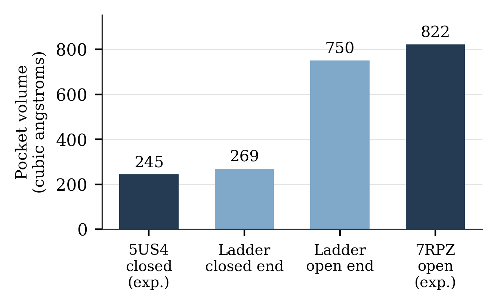
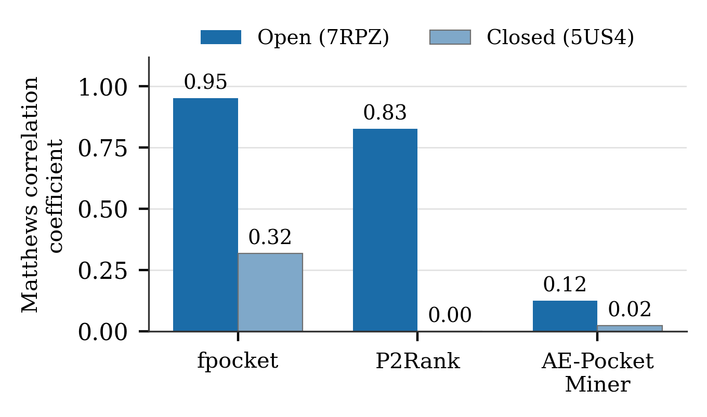
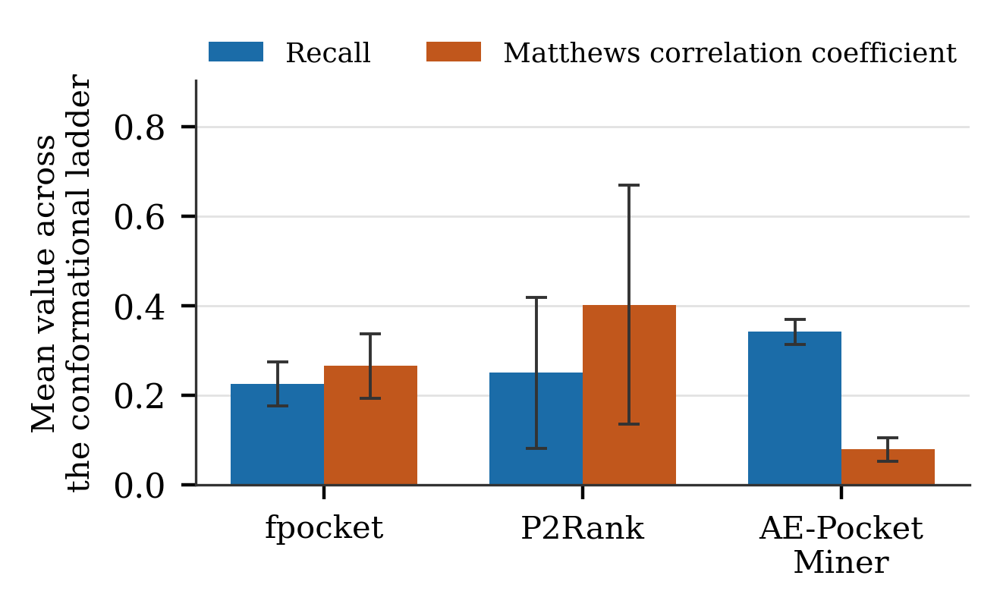
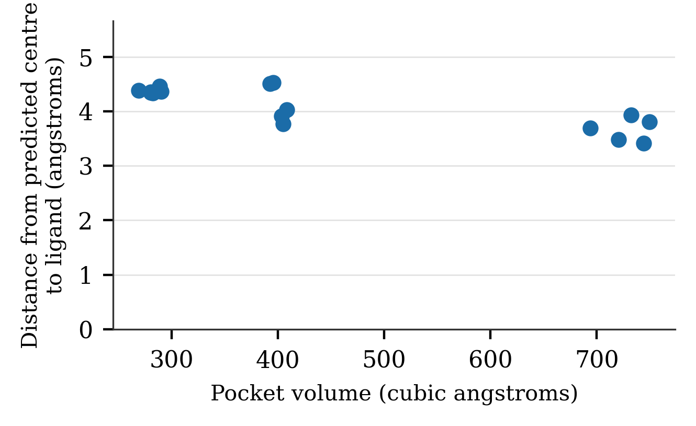

# KRAS G12D Cryptic-Pocket Benchmark

Geometry outperforms machine learning on an open cryptic pocket.

This project benchmarks three pocket-prediction tools that run without molecular dynamics (MD) on the KRAS G12D Switch-II pocket (SII-P). The SII-P is a cryptic pocket: it only forms when a drug binds, and it is the site of the G12D inhibitor MRTX1133. The tools are fpocket (pure geometry), P2Rank (general-purpose machine learning) and AE-PocketMiner (a graph neural network trained specifically for cryptic pockets). Each tool was run on the closed and open crystal structures and on a 24-conformer closed-to-open ladder, and scored against the residues MRTX1133 actually touches.

**fpocket on the open structure (7RPZ): recall 0.92, MCC 0.95**

**Status:** Experiment complete. Manuscript under review at the Columbia Junior Science Journal (CJSJ). [Read the paper](docs/paper.pdf)

## Why

KRAS was considered undruggable for about three decades until the Switch-II pocket was found to open under a bound ligand (Ostrem et al., 2013). MRTX1133 later used the same pocket in the G12D mutant, which drives the majority of pancreatic ductal adenocarcinoma cases (Waters & Der, 2018). Because a cryptic pocket is absent from the ground-state structure, researchers rely on software to find it. Most of those tools were developed on static, visible pockets, and the cryptic-pocket specialist is usually assumed to be the right default. This project tests that assumption on a clinically important target.

## Phase 1: Structures, answer key and docking check

Two high-resolution KRAS G12D crystal structures, both GDP-bound, so the only difference between them is the pocket state:

| PDB | State | Resolution | SII-P volume | fpocket druggability |
|---|---|---|---|---|
| 5US4 | apo, pocket collapsed | 1.83 Š| ~245 ų | 0.001 |
| 7RPZ | MRTX1133-bound, pocket open | 1.30 Š| ~822 ų | 0.684 |

- **Answer key:** the 25 residues with an atom within 4.5 Å of MRTX1133 in 7RPZ (Switch-II, helix 3 and the P-loop end of the ligand footprint). It is defined by what the drug touches, not by any tool's output, so it is independent of the methods being tested.
- **Quarantine:** 7RPZ is used only for the answer key, the docking check and scoring. It is never an input to the ladder ([`data/ANSWERKEY_DO_NOT_USE_AS_LADDER_INPUT/`](data/ANSWERKEY_DO_NOT_USE_AS_LADDER_INPUT/)).
- **Openness metric:** SII-P volume measured by fpocket, located by position near the His95 Cα so the same site can be tracked as the structure changes.
- **Docking check:** MRTX1133 redocked into 7RPZ with AutoDock Vina recovered the crystal pose at **0.96 Å RMSD** (pass threshold ≤ 2 Å), with a predicted affinity of −12.7 kcal/mol.

## Phase 2: MD-free conformational ladder

24 conformers were generated from closed 5US4 only, by displacing it in graded steps along its lowest-frequency normal mode (ProDy). This avoids MD, matching the sampling most labs can actually afford.

- SII-P volume rose from ~269 ų to ~750 ų, **91% of the open crystal structure**.
- The opening is not gradual. Conformers fall into three volume clusters, and the jump from ~400 ų to ~750 ų at conformer 15 is where the Switch-II wall forms.



## Phase 3: Benchmarking the three tools

All three tools were scored on the same residue set (chain A) with the same rules: a predicted pocket counts only if part of it is within 14 Å of His95, and a residue counts if it is within 4.5 Å of such a pocket. The 14 Å limit stops a tool from earning credit for the nucleotide site, which is already open. AE-PocketMiner gives per-residue probabilities, so residues at or above 0.7 count as predicted. MCC is the main metric because it also credits what a tool correctly leaves alone.

**On the crystal structures:**

| Tool | Structure | Recall | MCC | Precision | Residues flagged |
|---|---|---|---|---|---|
| fpocket | 7RPZ (open) | 0.92 | 0.95 | 1.00 | 23 |
| P2Rank | 7RPZ (open) | 0.72 | 0.83 | 1.00 | 18 |
| AE-PocketMiner | 7RPZ (open) | 0.40 | 0.12 | 0.22 | 45 |
| fpocket | 5US4 (closed) | 0.28 | 0.32 | 0.54 | 13 |
| P2Rank | 5US4 (closed) | 0.00 | 0.00 | n/a | 0 |
| AE-PocketMiner | 5US4 (closed) | 0.28 | 0.02 | 0.16 | 43 |

- On open 7RPZ, fpocket's predicted pocket centre was 2.3 Å from the ligand and P2Rank's was 3.6 Å. Both had perfect precision, so the gap between them is coverage, not false positives.
- On closed 5US4, P2Rank correctly proposed no pocket at the site. fpocket produced false positives.
- AE-PocketMiner flagged broadly on both structures. Its mean probability on true SII-P residues was 0.606 against 0.514 protein-wide on 7RPZ, and 0.537 against 0.514 on 5US4. Because this check uses no cutoff and both structures are experimental, the broad flagging is not caused by the 0.7 threshold or by the generated conformers.



**Across the 24-conformer ladder**, the ordering changes. P2Rank has the highest mean MCC (0.41 ± 0.27), followed by fpocket (0.27 ± 0.07) and AE-PocketMiner (0.08 ± 0.03), even though AE-PocketMiner has the highest mean recall.



P2Rank found no pocket within 14 Å of the site in 7 of 24 conformers:

| Volume cluster | Conformers | Volume (ų) | P2Rank detected | Mean recall when detected |
|---|---|---|---|---|
| Closed (~270) | 10 | 269–291 | 7 | 0.33 |
| Intermediate (~400) | 5 | 396–421 | 5 | 0.33 |
| Open (~720) | 9 | 682–750 | 5 | 0.41 |

## Phase 4: What the results show

- **Geometry wins on an open pocket.** Once the cryptic pocket has formed, it is geometrically an ordinary cavity, which fpocket's alpha spheres find well.
- **The specialist ranked last on both crystal structures.** AE-PocketMiner predicts which residues take part in pocket opening, not where a ligand binds. KRAS is flexible in several regions, so broad flagging has a structural explanation. This reads as a mismatch between the tool's target and the task, not as a defect in the tool.
- **Detection rate alone gives the wrong answer.** By detection rate, AE-PocketMiner would look successful and P2Rank would look like it failed on the closed structure. Both readings are backwards. Localization metrics (MCC, precision, distance to the ligand), computed from the same data, correct them.
- **Volume is necessary but not sufficient.** Four of P2Rank's misses were at open-state volume while their same-volume neighbours were detected. Once the Switch-II wall is present, detection depends more on local side-chain arrangement than on pocket size. Where P2Rank did detect the site, its predicted centre moved from ~4.4 Å from the ligand in the closed cluster to 3.4–3.9 Å in the open one.



Every arm, including the two crystal structures, was re-scored through the same scoring code before the paper was written. An earlier comparison that had not been scored that way was retired as a result, and none of its numbers appear here.

## Limitations

- Conformers come from normal mode analysis alone, so side chains are approximate. fpocket's fragmentation of the pocket across the ladder may reflect that rather than the tool.
- fpocket is both a benchmarked tool and the source of the openness axis. Scoring is unaffected because the answer key comes from the drug's contacts, but the axis is not independent of that tool.
- AE-PocketMiner's broad flagging may be specific to KRAS, which is flexible in several regions.
- This is one pocket on one target, so the ranking should not be generalized.

## Repo layout

```
src/
  paths.py              shared file locations
  phase1_validation/    rmsd_check.py (docking check), answer_key.py
  phase2_ladder/        build_ladder_dense.py, anchor_volumes.py, validation.py
  phase3_benchmark/     phase3_fpocket.py, phase3_p2rank.py, phase3_pocketminer.py, score_anchors.py
  phase4_figures/       make_figures.py
data/                   structures, ligand, docking files, ladder volumes, 7RPZ answer key
results/                per-tool CSVs, anchor table (Table I), cluster table (Table II)
figures/                paper Figs. 1–5
docs/paper.pdf          the manuscript
envs/                   conda environments
exploration/            superseded and one-off scripts, kept for transparency
```

## Running it

```bash
git clone https://github.com/ryanjmahn/KRASG12DBenchmarking.git
cd KRASG12DBenchmarking
conda env create -f envs/structprep.yml
conda env create -f envs/aepocketminer.yml
```

Install P2Rank 2.4.2 and AE-PocketMiner in the repo root, as described in [SETUP.md](SETUP.md). Then run the scripts in order with `conda activate structprep`. They can be run from any directory.

```bash
python src/phase1_validation/rmsd_check.py          # docking check: 0.96 Å
python src/phase2_ladder/build_ladder_dense.py      # 24 conformers -> runs/ladder_dense/
python src/phase3_benchmark/phase3_fpocket.py       # a few seconds
python src/phase3_benchmark/phase3_p2rank.py        # about 1–2 minutes
# run AE-PocketMiner on runs/ladder_dense/*.pdb in the aepocketminer env (see SETUP.md), then:
python src/phase3_benchmark/phase3_pocketminer.py
python src/phase3_benchmark/score_anchors.py        # Table I
python src/phase4_figures/make_figures.py           # Figs. 1–5 + Table II
```

`answer_key.py` regenerates the answer key, but it overwrites the notes at the end of the saved file, so it doesn't need to be re-run.

## Stack

Python · ProDy · fpocket · P2Rank · AE-PocketMiner · AutoDock Vina · Meeko · RDKit · NumPy · pandas · matplotlib

## Citation

```bibtex
@unpublished{ahn2026kras,
  author = {Ryan Jaemin Ahn},
  title  = {Geometry Outperforms Machine Learning on an Open Cryptic Pocket:
            Benchmarking Three MD-Free Computational Pocket Predictors on
            KRAS G12D Switch-II Pocket (SII-P)},
  note   = {Manuscript under review, Columbia Junior Science Journal},
  year   = {2026}
}
```

## License

MIT for the code. The protein structures (5US4, 7RPZ) and MRTX1133 (ligand 6IC) are from the RCSB Protein Data Bank.
